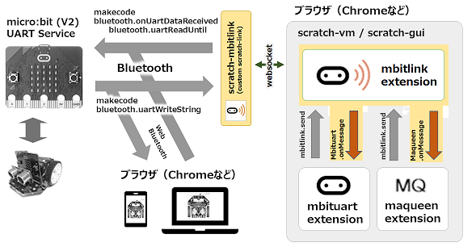

# sc3-mbitlink

- このリポジトリ

	- scratch-linkを改造(BLE UART対応)
	- bluetooth extensionのBLE部を分離・改造

## この拡張機能について

- この拡張機能を組み込むと、micro:bitとの接続・切断を表現する丸いボタンが表示されます。
- 保存されたプログラム(SB3)を読み込んだとき、拡張機能mbitlinkは自動的に組み込まれないことがあります。 
自動的に組み込まれないときは、手動で拡張機能 mbitlink を組み込んでください。
- micro:bit、maqueenのブロック（プログラム）を動かすためには、Scratch_mbitlinkが必要です。事前に起動しておいてください。
- micro:bitには専用プログラム（リポジトリ:mbitlink_hexにあります）が必要です。事前に専用プログラムを転送しておいてください。

## Scratch_mbitlinkについて

- Scratch_mbitlinkの実行ファイルには署名はついていません。
- Scratch_mbitlinkを起動すると、Scratch/Scratch desktopと通信するために ws://device-manager.scratch.mit.edu:20111 を開きます。
- Scratch_mbitlinkを介して通信されているかを確認したいときは「-g」を付加して起動してください。
